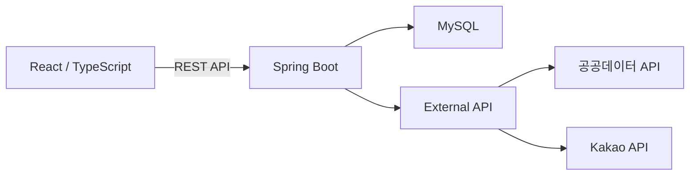

# Real Estate Transaction Dashboard

공공데이터 API와 국토교통부 실거래 Excel 데이터를 수집·관리하고,
지도와 데이터 표를 통해 아파트 실거래 정보를 조회하는 서비스입니다.

Spring Boot 기반 REST API와 React로 구현했으며, 
저장된 데이터와 외부 API를 함께 활용할 수 있도록 구성했습니다.
<p align="center">


</p>


## 주요 기능

### 실거래 데이터 조회 (표) 
- 반복적인 외부 API 호출을 줄이고, 저장된 데이터를 향후 통계·집계 기능에서도 활용할 수 있도록
공공데이터 api 호출 조회와 db조회를 함께 구현

- 데이터 저장 여부에 따른 조회 소스 분기
   - DB 저장 월 → DB 조회
   - DB 미저장 월 → 공공데이터 API 조회

### 실거래 데이터 관리 (관리자 import)

- 국토교통부 실거래 Excel 데이터 Import
- Apache POI 기반 대량 데이터 파싱 및 DB 저장
- 신규 아파트 등록 및 중복 생성 방지
- Import 기간 관리 및 중복 기간 업로드 차단
- 월별 DB 조회 승인 / 취소


### 인증 / 회원 관리
- 회원가입 및 중복 검사
- BCrypt 비밀번호 해싱
- Access / Refresh Token 발급
- 회원정보 조회 / 수정
- Access Token 만료 시 Refresh Token을 이용한 재발급


### 지도 기반 실거래 조회

* Kakao Maps API를 이용한 지도 표시
* 현재 지도 영역을 기준으로 실거래 데이터 조회
* 지도 이동/확대 시 조회 범위 자동 갱신
* 거래량에 따른 지역 시각화
* 아파트 위치 마커 표시
* 아파트별 거래 금액 및 거래 정보 확인
* 최소/최대 거래금액 필터


## Tech Stack

### Backend

* Java
* Spring Boot
* JWT
* MySQL
* Apache POI

### Frontend

* React
* TypeScript
* Vite
* Tailwind CSS

### DATA / API

- 공공데이터포털 아파트 실거래 API
- 국토교통부 실거래가 공개시스템 Excel
- Kakao API

## Architecture




## Excel Import
```text
Excel Upload
     ↓
Apache POI Parsing
     ↓
중복 기간 검사
     ↓
지역코드 매핑
     ↓
Apartment / Transaction 저장
     ↓
Import 이력 저장
```

데이터 출처에 따라 다른 지역 정보 형식을 통일하기 위해 Region 테이블을 사용.
Import 시작 시 Region 데이터를 한 번 조회하여 Map으로 변환한 뒤 행별 지역코드 매핑에 사용하여 반복적인 DB 조회를 줄였습니다.


## Map Data Loading

지도에서는 전체 실거래 데이터를 한 번에 조회하지 않고 현재 화면에 보이는 영역을 기준으로 데이터를 요청합니다.

```text
사용자 지도 이동
       ↓
Kakao Maps bounds 계산
       ↓
minLat / maxLat
minLng / maxLng
       ↓
Backend API 요청
       ↓
현재 영역의 아파트 조회
       ↓
지도 Marker 갱신
```

예시:

```http
GET /api/transactions/map
    ?minLat=37.48
    &maxLat=37.65
    &minLng=126.77
    &maxLng=126.98
```

이를 통해 지도 이동 시 필요한 범위의 데이터만 조회하도록 구성했습니다.


## 구현 과정에서 해결한 주요 문제
### [Issue #1 - 로그인, 회원가입](https://github.com/forthewy/realestate_web/issues/1)
- JWT 만료 요청이 403으로 처리되던 문제를 JwtFilter에서 401을 반환하도록 수정하여 Refresh Token 재발급 흐름 정상화


### [Issue #4 - 실거래 데이터 관리화면](https://github.com/forthewy/realestate_web/issues/4)
- API와 Excel의 서로 다른 지역 정보 형식을 Region 기반 sggCd로 통일
- 읍·면·리 등 주소 구조 차이를 고려한 지역코드 매핑 처리
  


## 개선 예정
- 지도 조회 API 성능 최적화
- 대량 데이터 Import 성능 개선
- 실거래 통계 / 집계 API 추가
- 지역별 거래량 시각화 개선

